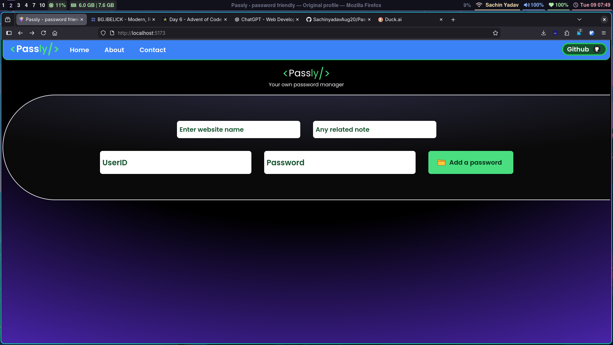
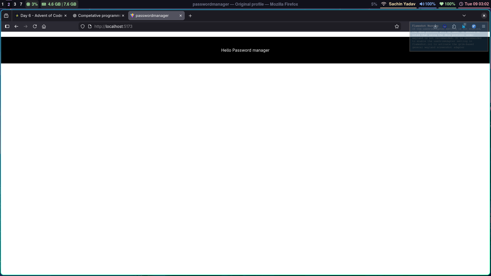

# Password Manager

A simple password manager application built with React, Vite, and MongoDB. This project allows users to securely store and manage their passwords.

## Tech Stack

- **Frontend:** React, Vite, Tailwind CSS
- **Backend:** Node.js, Express, MongoDB

## Backend Details

The backend is built with Node.js and Express, providing RESTful APIs for password management. It connects to a local MongoDB instance (database: 'Passly', collection: 'Password') to store and retrieve password data securely. The server runs on port 3000 and supports CORS for frontend communication.

## Journey

### Final looks (on 13/12/25)

### 10/12/25

### 9/12/25

### 9/12/25 

## How to Use It

This password manager can be used with a local MongoDB instance or run entirely on localhost.

### Prerequisites
- Node.js installed
- MongoDB installed and running locally (default port 27017)

### Installation
1. Clone the repository.
2. Install frontend dependencies: `npm install` in the root directory.
3. Install backend dependencies: `cd backend && npm install`.
4. Ensure MongoDB is running locally.

### Running the Application
1. Start the backend server: `cd backend && npm start` (runs on port 3000).
2. In a new terminal, start the frontend: `npm run dev` (runs on Vite's default port, usually 5173).
3. Open your browser and navigate to the frontend URL.
4. Add, view, and manage your passwords through the interface.

The app stores passwords in the local MongoDB database and fetches them via localhost API calls. It can also be configured to save passwords locally using browser localStorage for offline functionality.

## Features

- Secure password Local storage and mongoDB
- User-friendly interface

